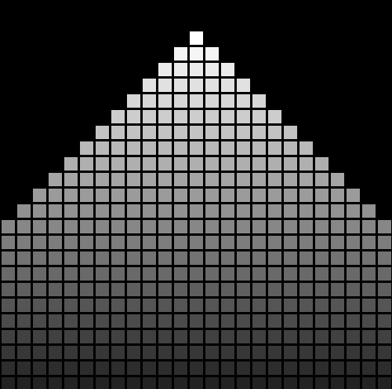
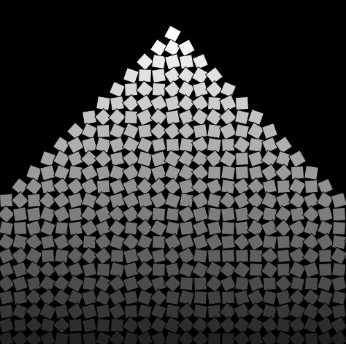

# Aflevering 3 : Pyramiden

I denne opgave skal I opbygge en pyramide ved hjælp af et for-loop inde i et andet for-loop. Pyramiden vil bestå af små firkanter, og bredden øges kun med en firkant i hver kant for hver ny række. Dette betyder, at det øverste niveau kun har 1 firkant, derefter 3 firkanter, 5 firkanter, 7 firkanter, og så videre. Desuden skal firkanterne gradvist blive mørkere for hver række.  
Det er vigtigt at bemærke, at I kun må bruge de variabler, der er defineret i de to for-loops for at løse denne opgave.

Hvis I søger en ekstra udfordring, kan I prøve at opbygge en pyramide, hvor hver firkant er roteret med en tilfældig vinkel.

Normal opgave              |  Svær opgave
:-------------------------:|:-------------------------:
  |  

------------------------------------

Krav til aflevering:
- En kort video (maksimalt 3 minutter), der forklarer jeres kode.
- Indsend selve koden.
- Hver gruppe må bestå af højst 2 personer.

Hints til kodning:
- Brug et indlejret for-loop til at opbygge pyramiden af firkanter.
- Bredden øges med 1 på hver side for hver ny række.
- Brug kun variabler, der er defineret i for-loop.
- Gør hver række lidt mørkere.