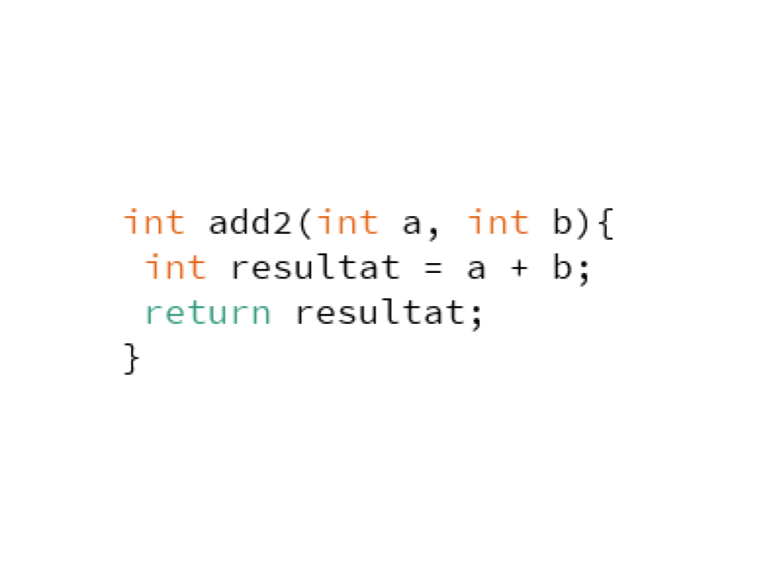

# Funktioner
Dette emne er af afgørende betydning - sørg for at forstå det! Dette forløb fokuserer på funktioner, også kaldet metoder i objektorienterede sprog som f.eks. Java (og Processing er baseret på Java under overfladen). Du kan tænke på funktioner eller metoder som "underprogrammer," som du kan kalde flere gange fra "hovedprogrammet". Der er også en lighed med matematiske funktioner, da du kan sende "input" til funktionen og få et "output" retur!

## Funktionens opbygning:
- ***Funtionens navn*** : anvendes til at "kalde" funktionen, når den skal anvendes
- ***Parametre også kaldet metodeinput eller funktionsinput*** : kan bruges til at sende værdier til funktionen, kaldes "agrumenter"
- ***Metodekrop eller funktionskrop*** : selve funktionens funktionalitet er skrevet inde i metodekroppen, som altid i Java markeres dette med krølle-paranteser
- ***Returtype*** : I starten af funktionen ses hvad den returnerer i form af en bestemt datatype 
- ***Returværdi*** : Selve værdien der sendes tilbage fra funktionen kaldes returværdien

## Funktionens anvendelse

- Argumenter
- "Kald"
