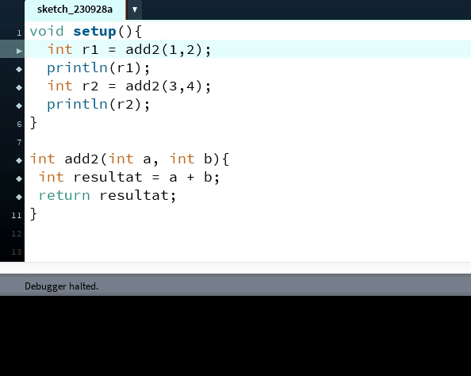

# Funktioner
Dette emne er af afgørende betydning - sørg for at forstå det! Dette forløb fokuserer på funktioner, også kaldet metoder i objektorienterede sprog som f.eks. Java (og Processing er baseret på Java under overfladen). Du kan tænke på funktioner eller metoder som "underprogrammer," som du kan kalde flere gange fra det "hovedprogram," når det er nødvendigt. Der er også en lighed med matematiske funktioner, da du kan sende "input" til funktionen og få et "output" retur!

Nye faglige begreber, som I skal lære, inkluderer:

- Parametre
- Argumenter
- "Kald"
- Returtype
- Metodekrop eller funktionskrop
- Metodeinput eller funktionsinput