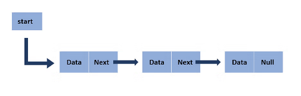

# Forløb 12 - 5B
<h1>Den svære : linked list</h1>

I skal lave den såkaldte linked list datastruktur som ses ovenfor.   
Det er en supsmart og meget brugt datastruktur der kan bruges til at implementere de almen kendte datastrukturer kaldet "kø" og "stak"

[https://en.wikipedia.org/wiki/Linked_list](https://en.wikipedia.org/wiki/Linked_list)

## Del 1 : Lav node klassen
Noden, der indeholder elementes data skal selvfølgelig kunne anvende alle slags datatyper. Derfor skal i lave denne som en generisk klasse:
[https://www.geeksforgeeks.org/generics-in-java/](https://www.geeksforgeeks.org/generics-in-java/)

## Del 2 : Lav stakken
En stak er en meget anvendt datastruktur. Den fungerer som en stak parpirer på et bord, hvor man kun indsætter og fjerner elementer fra topppen.
Implementer en linked list - stak. Den skal have metoderne:

- push : der kan indsætte et element
- pop : der kan fjerne et element

## Del 3 : Lav køen
En er ligeledes en meget anvendt datastruktur. Den fungerer ligesom køen nede i Netto. I den ene ende går folk ind i den anden ande går de ud.
Implementer en linked list - kø. Den skal have metoderne:

- enqueue : der kan sætte et element ind i køen
- dequeue : der kan fjerne et element fra køen

## Del 4 : fjerne eller find bestemte elementer
Kan du også lave metoder der fjerner og indsætter elementer fra køen?