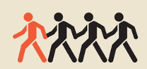

# Forløb 12 - 5A
<h1>Den almindelige opgave : Follower</h1>

Du skal lave en klasse "Follower", og et objekt af klassen , der hele tiden bevæger sig imod musens position.  
Og derefter udbygge den så du har et objekt mere, der følger efter det første,....

-----------------------------------------------------------------------

## Del 1: Lav klassen 

Klassen skal indeholde følgende data:
- positionens koordinater, x og y

Klassen skal indeholde følgende metoder/funktioner:
- en funktion "display", der kan tegne objektet
- en funktion "move", der kan flytte objektet en pixel tættere på musens koordinater 

-----------------------------------------------------------------------

## Del 2: Lav et objekt af klassen og brug det

Anvend klassen ved at oprette et objekt
- Lav et nyt globalt objekt af klassen "Follower" 
- I draw kald objektets "display" og "move" funktion

-----------------------------------------------------------------------

## Del 3 : Afprøv og tilpas programmet
Du skal nu afprøve dit program.   
Måske kan du få dit objekt til at stoppe lidt inden det når din musens position?
Ser det godt ud eller skal du lave noget om?

-----------------------------------------------------------------------

## Del 3: Lav et nyt objekt der følger efter det første

Du skal nu lave et globalt objekt mere af Follower klassen, og få det til at følge efter dit først objekt.
Denne opgave er lidt svær... Du skal sandsynligvis omskrive din "move" funktion. 
Du kan give funktionen to nye parametre, der indeholder x og y for den position du gerne vil følge...

Nu skal det første objekts move kaldes med musens koordinater, det næste objekt skal kaldes med det første objekts koordinater. 
