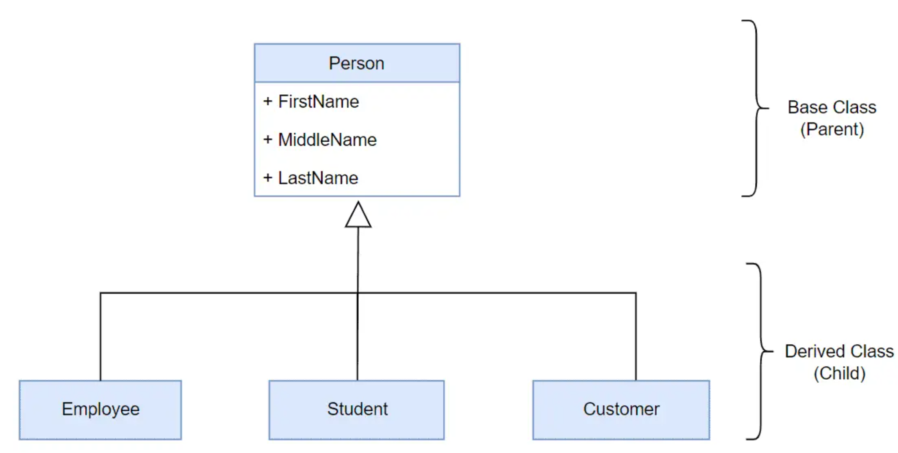
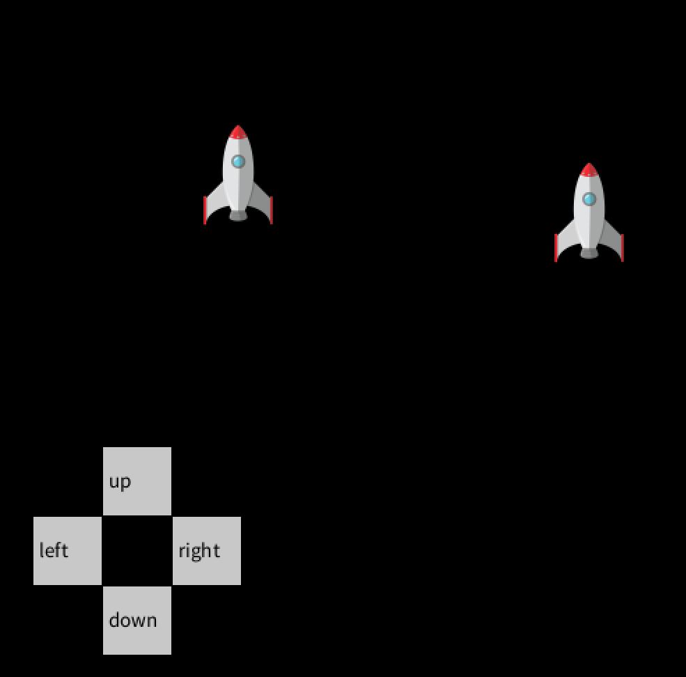

# Forløb 13
# Raketter og knapper, nu med nedarvning

Opgaven i denne omgang er at lave projektet raketter og knapper vha. nedarvning. I kan se den orindelige opgave her:       
[Forløb 12 - Knapper der flytter raketter](../../forlob12_oop1/Part4/Part4raketopgave.md).

Jeg har lavet et løsningsforslg som i kan se her:    
[Løsnings forslag til - Knapper der flytter raketter](raketKnapLosning.md)

I skal lige kende til "override" og hvilke fordele der er ved denne teknik. Vi kigger lige i kapitlet fra sidst:    
[bogen learning processing, kap. 22 : advanced object oriented programming](../intro/AdvancedOop22.pdf)

-----------------------------------------------------------------------------------------------------------------------

## Opgaven : ombyg koden så den anvender nedarvning

Anvend enten din egen løsning fra "Knapper der flytter raketter" eller brug min løsning ovenfor som udgangspunkt.

1. : identificer hvordan du med fordel kan anvende nedarvning (systemet skal muligvis udbygges med en ny klasse?)
2. : byg/ombyg klasserne så de anvender nedarvning, baseret på din analyse fra spørgsmål 1 
3. : udtænk og byg/ombyg de konstruktører, der nu skal være i dine klasser
4. : udtænk og byg/ombyg de funktioner, der kan flyttes direkte op i din superklasse
5. : udtænk og byg/ombyg de funktioner, der skal flyttes op i din superklasse, men også overskrives med ny funktionalitet (override)
6. : (frivillig) Hvis alle dine objekter har samme super-type kan de flyttes ind i et array. Prøv at flytte alle dine objekter ind i et array og anvend det i et loop istedet for at kalde metoder på hver enkelt objekt direkte