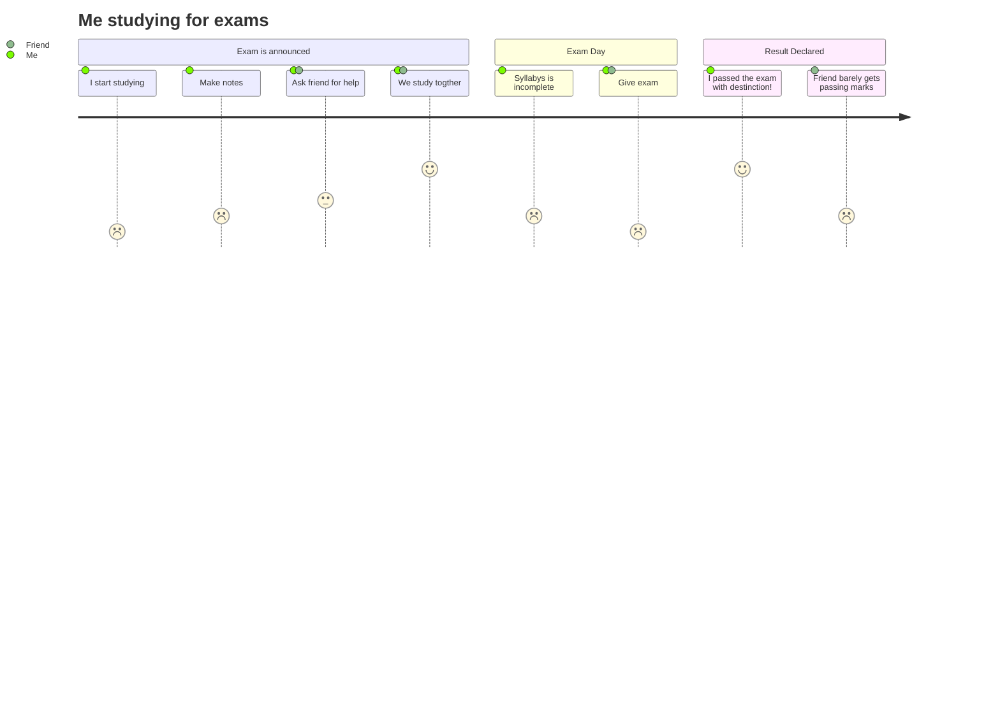

# Forløb 13
## Del 4 - Klasse-diagrammer

## Emner : oop diagrammer og dokumentation
...
Når man anvender om klassediagrammer ifm. processing bør man være opmærksom på mindst fire ting.
1. For det første virker "class Visibility" ikke ordentligt i prcessing, så det kan vi ikke angive i vores klassediagrammer.
2. For det andet eksisterer der ikke noget der hedder "Parameter Directionality", så det angiver vi heller ikke.   
3. Desuden er processing java under "motor-hjelmen" - alt er faktisk inde i en stor klasse! [et eksempel på processings java-kode!](eksempel_processing_java.md)

## Tutorial i klassediagrammer
Nedenfor har jeg fundet nogenlunde en tutorial for hvordan man tegner klassediagrammer. 
- [UML Class Diagram Tutorial - af visual paradigm](https://www.visual-paradigm.com/guide/uml-unified-modeling-language/uml-class-diagram-tutorial/)

## Værktøjer til at tegne klassediagrammer
Jeg foreslår i bruger et af føgende værktøjer til at tegne jeres klassediagrammer, men i er selvfølgelig velkomne til at anvende andre:
- [Diagram værktøj : https://online.visual-paradigm.com/](https://online.visual-paradigm.com/)
- [Diagram værktøj : https://app.diagrams.net/](https://app.diagrams.net/)

graph TD;
    A-->B;
    A-->C;
    B-->D;
    C-->D;

[Et diagram :-)](test2Mermaid.html)

-------------------------------------------------------------------------------------------------------------------------------------------------------

## Dagens opgave

Tegn et detaljeret klasse-diagram for jeres program fra "knapper og raketter, med nedarvning".  
Eller et lignende kompliceret program.
I er færdige når jeg har godkendt det ;-)
