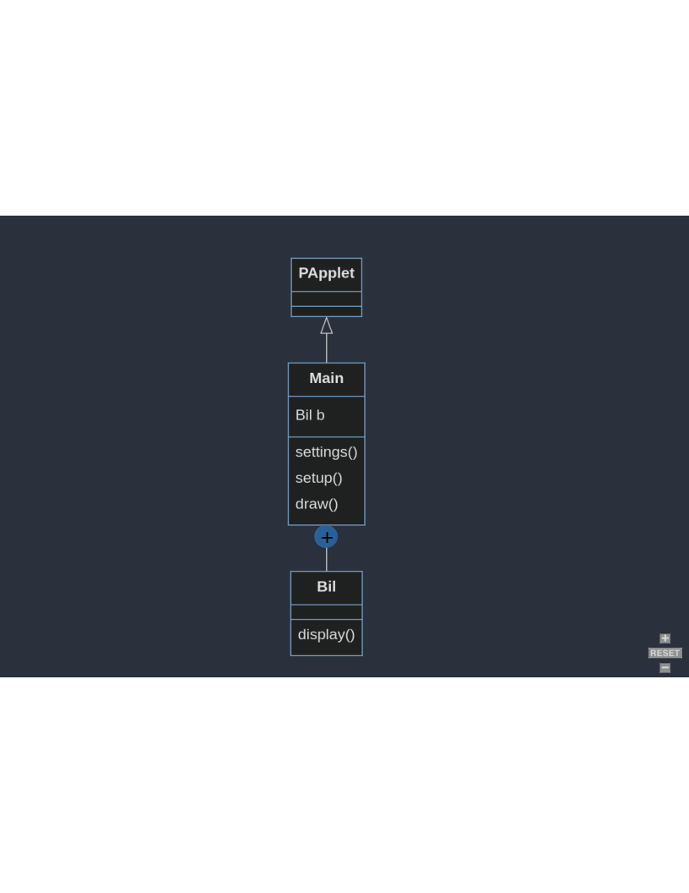

# Forløb 13
## Del 4: Klassediagrammer
#### Eksempel : Hvordan ser et processing programs javakode ud, når man kigger under motorhjelmen?

Her er et eksempel på en processing kode kaldet "Main":

```java
Bil b;

void setup(){
    size(500,500);
    b = new Bil();
}

void draw(){
    b.display();
}

class Bil{
    void display(){
        rect(10,10,10,10);
    }
}
```
Her er den java-kode, der automatisk genereres af processing-sketch-book IDE'en når du kører programmet.   
Læg mærke til at der er en ydre klasse som har samme navn som dit program, og at alle de  klasser du har lavet er inde i denne klasse:

```java
import processing.core.PApplet;

public class Main extends PApplet {

    Bil b;

    public static void main(String[] args) {
        PApplet.main("Main");
    }

    public void settings() {
        size(500, 500);
    }

    public void setup() {
        b = new Bil();
    }

    public void draw() {
        b.display();
    }

    class Bil {

        void display() {
            rect(10, 10, 10, 10);
        }
    }
}
```

Her er et klassediagram for koden, læg mærke til den specielle "pil" der indikerer at Bil er en indre klasse i Main:

