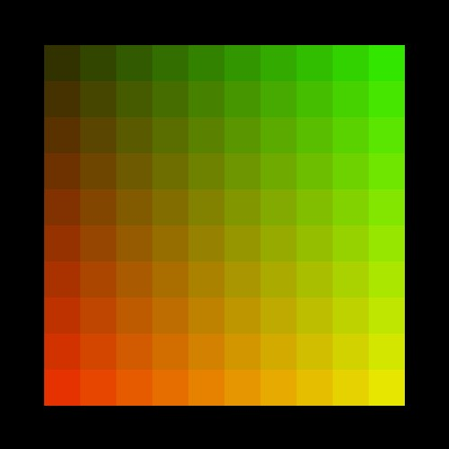

# Loops - for og while

Referencen:
- [while loops - i referencen](https://processing.org/reference/while.html)
- [for loops - i referencen](https://processing.org/reference/for.html)

Eksempler på for-loops:
- [eksempler på for-loops](loop_for_eksempler.md)

Slides:
- [slides loops]()

***Opgaver i både for og while:*** I må selv om hvilken rækkefølge i vælger at lave opgaverne i... (husk i skal bestemme hvornår loopet skal stoppe!)

I behøver ikke lave alle disse opgaver - hvis i er sikker på i kan!!

1. Skriv en for og while-løkke, der udskriver tal fra 1 til 10.
2. Lav en for og  while-løkke, der udskriver de første 5 lige tal (2, 4, 6, osv.).
3. Lav en for og  while-løkke, der udskriver summen af tal fra 1 til 100.
4. Skriv en for og  while-løkke, der tæller ned fra 10 til 1 og udskriver tallene.
5. Lav en for og  while-løkke, der udskriver gangetabellen for tallet 5 (5, 10, 15, osv. op til 50).
6. Lav en for og  while-løkke, der udskriver de første 5 potenser af 2 (2^1, 2^2, 2^3, osv.).
7. Tegn en for og  serie af lodrette linjer ved hjælp af en while-løkke, der ændrer deres x-koordinat for hver gentagelse.
8. Skriv en for og  while-løkke, der tegner en spiral ved at ændre både x- og y-koordinaterne for hver gentagelse.
9. Lav en for og  while-løkke, der tegner en regnbue af farverige linjer ved at ændre farverne gradvist for hver gentagelse.
10. Tegn en for og  slags "trappe" ved at bruge en while-løkke til at skabe forskellige brede rektangler ved hvert trin.

***Opgave i for-loop:***

lav 10x10 små firkanter i midten af skærmen hvor firkanterne bliver gradvist mere røde nedad og gradvist mere grønne mod højre

