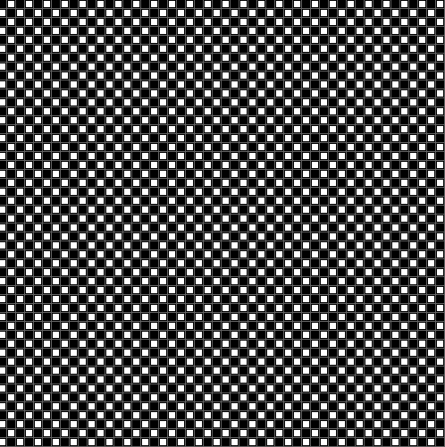
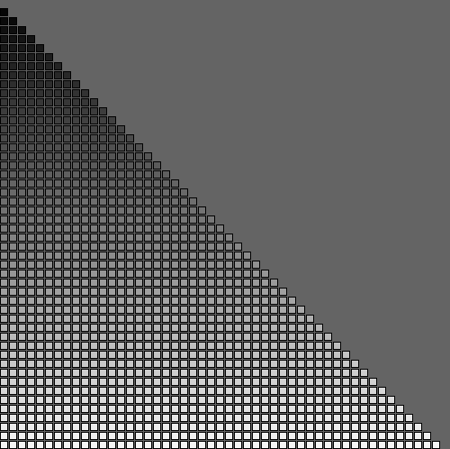

# Nestede for-loops

Nestede for-loops i Processing er en teknik, hvor vi bruger en eller flere for-loops indeni et andet for-loop. Dette giver os mulighed for at oprette komplekse gentagelsesmønstre og arbejde med to- eller flerdimensionale strukturer som gitter, matricer og fraktaler. Hver indlejret løkke gentages for hver iteration af den ydre løkke, hvilket giver en kraftig kontrol over gentagelsesprocessen og tegning i Processing.

Her et lille eksempel:

```java
for(int i=0; i<10 ; i++){
  for(int j=0; j<10; j++){
    println(i,j);    
  }
}
```

## Opgaver i nestede for loops: I skal forklare løsningerne i jeres logbog

### Opgave 1: 
Lav et mønster med cirkler: Brug en for-løkke til at tegne flere rækker af cirkler. Inde i hver række skal du bruge et indlejret for-loop til at placere cirklerne i en linje. Se billede nedenfor:


### Opgave 2: 
Tegn et skakbræt: Brug to nestede for-loops til at tegne et skakbræt med rækker og kolonner af firkantede celler. Skift farve mellem sorte og hvide celler. Se billede nedenfor:

(svær udfordring : du kan prøve at se om du kan tegene samme mønster med kun et for-loop ved anvendelse af "%" og "/")



### Opgave 3: 
Tegn en trappe: Byg en trappe: Brug to for-loops, hvor det ene er indlejret i det andet, til at tegne en trappe, bestående af små firkanter. Hver trin skal være bredere end det foregående. Se billede nedenfor:


