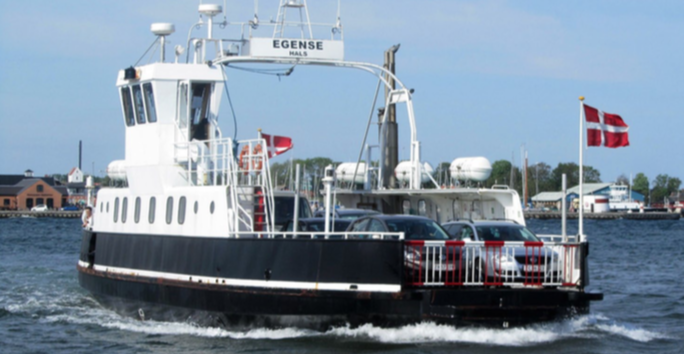

# Projekt : Færge over Limfjorden 

I skal i dette projekt lave et værktøj, der kan simulere matematikprojektet ***Projekt om vektorer i 2D: Færge over Limfjorden***.
Udviklingen af projekterne skal foregå i grupper på 2 eller, hvis aftalt, 3 personer.

## Minimumskrav til projektet. 

Det er selvfølgelig tilladt at have flere funktionaliteter:
- I skal opbygge programmet vha. funktioner, hvor hver funktion kun må have et "ansvars-område" og højest have et omfang på 10 "kode-linjer"
- Det skal være muligt at vælge en hastighed og kurs for både færgen og strømmen, imens programmet kører 
- Der skal være information-panel for både færgen og strømmen
- Det skal være muligt at starte, stoppe og vælge "reset" af en simuleringen af sejlturen med færgen
- Der skal være et kort som baggrund, der har et størrelsforhold der matcher størrelseforholdet på beregningen af færge og strøm hastighed

## Diverse materiale

[Løsnings-eksempel](projekt1eksempel.md)

[PVector datatypen](https://processing.org/reference/PVector.html)

[2D Transformationer til simulering](https://processing.org/tutorials/transform2d)

## Projektplan

<table>
    <tr>
        <th style = "text-align: left">dato</th>
        <th style = "text-align: left">indhold</th>
    </tr>
    <tr>
        <td style = "text-align: left">Fre 6/10 - 1</td>
        <td style = "text-align: left">(1) lav skitser over programmets brugerflade og   (2) lav forløbig liste over programmets funktioner</td>
    </tr>
    <tr>
        <td style = "text-align: left">Fre 6/10 - 2</td>
        <td style = "text-align: left">Programmer info-panel for skibs og strøm hastighed</td> 
    </tr>
    <tr>
        <td style = "text-align: left">Ons 11/10 - 1</td>
        <td style = "text-align: left">Programmer simulering/animation af skibs-bevægelsen</td>
    </tr>
    <tr>
        <td style = "text-align: left">Ons 11/10 - 2</td>
        <td style = "text-align: left">Programmer start, stop og 'reset' af skibs-bevægelsen og ...</td>
    </tr>
    <tr>
        <td colspan="2" style = "text-align: left">Aflevering fredag d.13/10 kl.</td>
    </tr>
</table>

