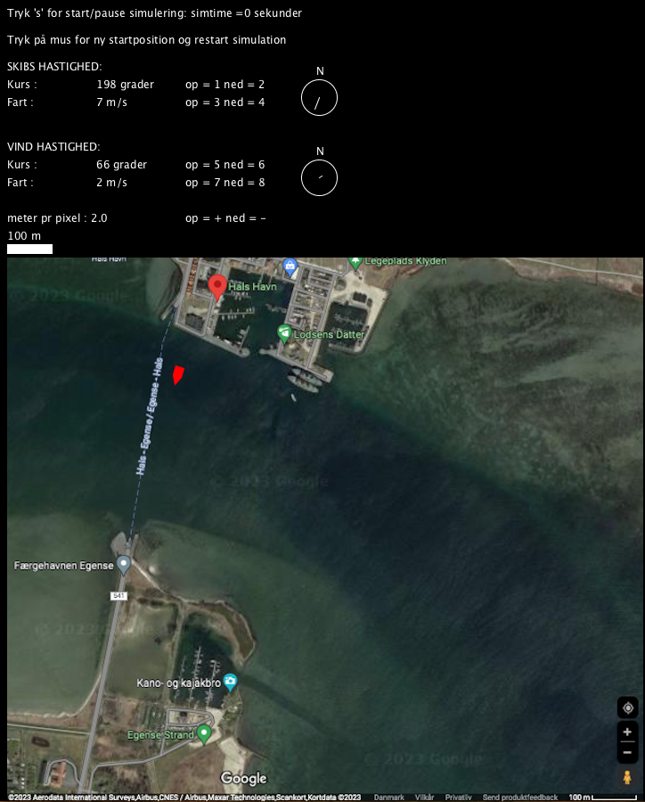

```java
PImage kort;

PVector skib_start = new PVector(0,0);
PVector skib_pos   = new PVector(0,0);  
PVector skib_hast  = new PVector(5,0);
char[]  skib_keys  = {'1','2','3','4'};  

PVector vind_hast  = new PVector(5,0);
char[]  vind_keys  = {'5','6','7','8'};

boolean sim_runing = false;
int simTime        = 0;

float meter_pr_pixel = 2.0;
char[] skala_keys = {'+','-'};

void setup(){
  size(800,900);
  kort = loadImage("kort.png");
}

void draw(){
  background(0);
  image(kort,10,290);
  fill(255);
  text("Tryk 's' for start/pause simulering: simtime =" + simTime + " sekunder",10,20);
  text("Tryk på mus for ny startposition og restart simulation",10,50);
  hastigheds_panel("SKIBS HASTIGHED:",  10,  80,  skib_keys,  skib_hast);
  hastigheds_panel("VIND HASTIGHED:",   10,  170, vind_keys,  vind_hast);
  skala_panel(10,250, skala_keys);
  tegn_skib(skib_pos, skib_hast,skib_start);
  if(sim_runing){
    simulation();  
  }
}

void keyPressed(){
 skib_hast       = hastigheds_user_update(  skib_hast,  skib_keys); 
 vind_hast       = hastigheds_user_update(  vind_hast,  vind_keys); 
 meter_pr_pixel  = skala_user_update(   meter_pr_pixel, skala_keys);
 if(key=='s'){ 
   sim_runing =!sim_runing ;
 }
}

void mousePressed(){
 sim_runing = false;
 simTime = 0;
 skib_pos.set(0,0);
 skib_start.set(mouseX,mouseY); 
}
```

