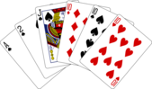

# Projekt 2 : Kortspil

I skal nu gå i gang med at udvikle et kortspilsprogram.

Som udgangspunkt for spillet skal I anvende et "kortspilsbibliotek", der indeholder klasser og funktioner til simulering af kort, blanding af kort, trækning af kort, osv. Jeg har allerede lavet et bibliotek, som I kan bruge, men det er også tilladt at udvikle jeres eget bibliotek. Uanset hvad jeres gruppe vælger, skal I dog stadig udvikle både design og brugerinterface.

Dem, der har kom-it A-niveau, har allerede designet et spil, og skal tage udgangspunkt i dette under udviklingen af programmet. Hvis man ikke har et design, skal man tænke et ud, som skal godkendes, inden programmeringen påbegyndes.

God fornøjelse - og godt nytår! 😊

## [Kortspils bibliotek -tryk og se github-repository](https://github.com/prog2di/KortspilsBibliotek/tree/main){:target="_blank"}

## Minimumskrav

- Maksimalt tre personer pr. gruppe
- Programmet skal simulere et rigtigt kortspil
- Det skal være muligt at spille mod computeren
- Man skal kunne spille videre uden at genstarte programmet

## Forløbsplan
- **uge2**, 3 moduler  : [Se beskrivelse uge 2 : Skitser, krav og klasse-diagram](uge2.md) 
- **uge3**, 3 moduler  : [Se beskrivelse uge 3 : færdiggørelse af brugerfladen](uge3.md)
- **uge4**, 1 moduler  : test og fejlretning 
- **uge5**, 0 moduler  : - 
- **uge6**, 2 moduler  : lav aflevering

## Aflevering
- Endeligt klassediagram med dertilhørende beskrivelse og/eller noter/forklaring på diagrammer
- Koden
- Video, med forklaring af kode, klassediagram og demo
